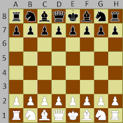

# Chess bot

A discord bot for playing chess over discord!

*Note*: currently there is no rule checks for any units so you need to make sure you make legal moves.

[Click here to join your server](https://discord.com/api/oauth2/authorize?client_id=782413879862493235&permissions=0&scope=bot)

## Building
Just run go build or build the docker image

## Running 
Refer to env/env.go to see what env vars you need set

## Using
Following is a list of commands

`-cb help` will print out all commands regex's (gross)

`-cb {@TARGET_PLAYER_HERE} start` will start a new game with a player

`-cb {@TARGET_PLAYER_HERE} move {FROM} {TO}` will move piece from 
coordinate to coordinate
`-cb {@TARGET_PLAYER_HERE} resign` will concede a game 

`-cb {@TARGET_PLAYER_HERE} get moves` will create a gif of the match 
so far along with the move list in algebraic notation gif shown below.

